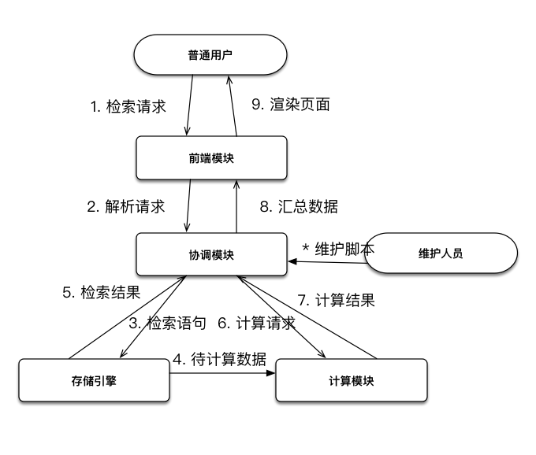

# API性能报告

[TOC]

## 生产环境部署配置

一开始没有对生产环境的后端服务器进行特殊的部署，只采用了Django的内置服务器并直接对外提供服务。但是简单地使用了apache benchmark工具进行性能测试，发现在进行10个以上的同步请求时就出现了明显的性能下降；在100个以上的同步请求时几乎难以正常服务，所以进行了生产环境的部署。

### uWSGI+Nginx

WSGI是Python应用程序或框架和Web服务器之间的一种接口，已经被广泛接受, 它已基本达成它的可移植性方面的目标。它并没有具体的应用程序，更像一个协议。简单来说，它定义了对于HTTP/TCP请求的低层封装，使应用程序只需要关注收到的request和当时的context，并返回相应的response就可以实现一个服务器。

uWSGI是python的一个实现了WSGI协议的应用程序，Django中也提供了uWSGI的服务器。在生产环境下，一般用uWSGI调起Django的服务，在前端（这里指服务器的前端）由Nginx之类的反向代理服务器对请求进行转发，比如直接由Nginx提供静态文件支持（因为前后端分离，这里主要是接口文档的静态内容），将动态内容转发至Django。

最终的调用栈如下：

```
the web client <-> the web server(Nginx) <-> the socket <-> uWSGI <-> Django
```


### 重温一下系统架构

在这一步再重温一下系统架构，有利于我们在后面进行性能测试遇到性能问题时快速找到瓶颈。



- 前段模块由Vue+webpack编译出的静态文件（模版、js、css等）组成，由Nginx提供服务，映射在7070端口。
- 协调模块由Django提供服务，从uWSGI启动，通过socket文件的方式监听请求（开销比通过http服务或是host:port模式的socket更小）；动态内容由Nginx进行反向代理，监听6567端口并转发至socket。
- 存储引擎由MySQL提供服务，通过DjangoORM与协调模块相连，通过pymysql与计算模块相连。
- 计算模块是自己写的模块，主要由gensim、numpy等包提供计算支持；通过thrift协议与协调模块通信。

### 并发设置

在目前的使用场景以及后续的压力测试中，与并发相关的配置如下：

```
uwsgi: processes=12 threads=12 max-requests=30000

mysql: max_connections=151

nginx: max_xxx_timeout=300
```

uwsgi的processes与threads顾名思义，是启动的进程与线程数，经过测试显著影响服务器的并发能力；max-requests是当一个work完成了这么多请求后，自动重启，是一个潜在的防止内存泄漏的策略。每一个work在启动时会有大约2s的延迟，因此当12个worker都启动后，服务器能够进入最佳的响应状态。

mysql的最大连接数是同一时刻在连接池中可以开启的最多连接数量，这个数值越大并发能力越高。但是如果连接池过大可能会导致连接的不复用，以及会占用大量的file descriptor（Linux系统中定义了其最大值，与socket可以开启的最大连接数共享这个数量），所以一般会建议日常连接数/最大连接数大于10%。后面的压力测试中会看到由于这个数值太小导致的数据库请求失效，但是考虑到日常使用的情况，没有把这个值改到更大。

nginx的max_xxx_timeout指的是max_read_timeout, max_send_timeout和max_connect_timeout，用于设定与uwsgi应用程序通信的超时时间。这里设置成了5分钟，以防止一些过慢的请求超时。

## 压力测试

### 压测软件与环境

压测软件一开始用的是apache benchmark（也就是ab），但是功能相对来说弱了一些，所以后面的测试采用了别的软件。

Vegeta可以提供稳定的QPS压力源，Boom可以提供稳定的并发数压力源。简单来说，Vegeta是每秒一定会提供指定数量的请求，然后去查看这些请求的响应时间、成功与否等等；Boom则是保持指定数量的并发数，每完成一个请求就继续发起新请求，从而可以查看在指定并发数下的QPS以及具体有多少请求成功等等。

压测环境为Macbook Pro i5 16G，使用有线网卡。

为了防止数据库缓存对大量重复请求带来的性能提升，暂时关闭了数据库缓存功能。

## 压测结果与性能优化

如果不做特殊说明，以下结果都是Vegeta的评测结果，即稳定的QPS源，我们关注在指定QPS的情况下请求的**成功率**与**响应时间**。

### 静态内容与基本查询

这一部分包括对静态文件服务器、对entryeditor的获取、查询请求的测试。

#### 1. :7070/#/entryeditor/

*这是唯一一个对7070端口测试的请求，主要查看对静态内容的支持能力。*

接口描述：词条页面首页。

测试结果：

| QPS                  | Duration      | Total Requests | Success Ratio | Response Time[Mean] | Response Time[P99] | Response Time[P95] |
| -------------------- | ------------- | -------------- | ------------- | ------------------- | ------------------ | ------------------ |
| 100.20040301042972/s | 4.98999989ss  | 500            | 1             | 2.36498ms           | 5.813165ms         | 3.703833ms         |
| 200.20020605189794/s | 4.994999854ss | 1000           | 1             | 1.816163ms          | 6.036699ms         | 2.579277ms         |
| 500.2000948438604/s  | 4.997999852ss | 2500           | 1             | 1.2368ms            | 4.449893ms         | 1.545867ms         |
| 1000.200064217685/s  | 4.998999879ss | 5000           | 1             | 980.454µs           | 5.421186ms         | 1.348123ms         |

分析：可以看到静态文件的支持远没有达到瓶颈。

#### 2. /entryeditor/entryeditor/

*从这里开始，所有的请求都是指向6567端口的Nginx+uWSGI+Django服务器了。*

接口描述：获取词条列表。

测试结果：

| QPS                  | Duration      | Total Requests | Success Ratio | Response Time[Mean] | Response Time[P99] | Response Time[P95] |
| -------------------- | ------------- | -------------- | ------------- | ------------------- | ------------------ | ------------------ |
| 100.20040345219505/s | 4.989999868ss | 500            | 1             | 395.235702ms        | 734.081789ms       | 634.240584ms       |
| 200.2002045689334/s  | 4.994999891ss | 1000           | 1             | 439.869085ms        | 700.466546ms       | 632.692099ms       |
| 500.2000888390572/s  | 4.997999912ss | 2500           | 0.6364        | 503.390387ms        | 1.050917701s       | 971.527551ms       |
| 1000.200057014804/s  | 4.998999915ss | 5000           | 0.3192        | 257.432377ms        | 1.024657556s       | 929.852721ms       |

分析：在500和1000QPS下发生了大量的请求失效，检查错误码后发现几乎都是502 Bad Gateway，其来源是Nginx无法与uwsgi建立有效连接。尝试修改了上文介绍的uwsgi的processes和threads的数值后，对请求的成功率有显著影响（在processes=6, threads=12时在200QPS下就会产生约30%的请求失效，目前的参数12*12已经是修改过的了）。考虑到每个worker的启动代价和系统开销，在目前的使用条件下可以接受这个性能。

#### 3. /entryeditor/entryeditor/47

接口描述：获取词条内容。

测试结果：

| QPS                  | Duration      | Total Requests | Success Ratio | Response Time[Mean] | Response Time[P99] | Response Time[P95] |
| -------------------- | ------------- | -------------- | ------------- | ------------------- | ------------------ | ------------------ |
| 100.20040359275673/s | 4.989999861ss | 500            | 1             | 573.628774ms        | 1.954327877s       | 1.286602482s       |
| 200.20020504989486/s | 4.994999879ss | 1000           | 0.993         | 4.686742348s        | 14.319747692s      | 9.338091762s       |
| 500.2000965452213/s  | 4.997999835ss | 2500           | 0.7816        | 15.49724053s        | 1m58.930136354s    | 32.042294759s      |
| 1000.2000956302514/s | 4.998999722ss | 5000           | 0.335         | 8.541642339s        | 2m3.155489541s     | 17.253533735s      |

分析：可以看到与上一个接口的情况类似，但是错误码与上一个不同。在这次压测中，主要的错误不再是502，而是压测软件的连接超时。200QPS下的几个请求失效也是连接超时。初步猜测是由于词条内容比较多，受限于评测机的带宽和处理能力，大量请求没有正确解析。

响应时间相比上一个接口在高并发情况下有明显上升，其来源同样是带宽限制。

### 词条操作

这一部分包含了词条中执行命令、初始化、对比等操作。因为初始化操作就包含了对数据库的修改性能测试，所以不再单独测试PUT方法。

#### 4. /entryeditor/entryeditor/47/execute/

接口描述：在指定词条中执行命令命令。

请求体：{"command":"freq(pattern=水)"}

测试结果：

| QPS                  | Duration      | Total Requests | Success Ratio | Response Time[Mean] | Response Time[P99] | Response Time[P95] |
| -------------------- | ------------- | -------------- | ------------- | ------------------- | ------------------ | ------------------ |
| 10.204081872136616/s | 4.899999885ss | 50             | 1             | 146.968077ms        | 171.659161ms       | 166.905008ms       |
| 50.200804251141136/s | 4.979999897ss | 250            | 1             | 165.551678ms        | 221.818392ms       | 206.208339ms       |
| 100.20040417508376/s | 4.989999832ss | 500            | 1             | 298.135302ms        | 518.805226ms       | 442.471848ms       |
| 200.20021018015063/s | 4.994999751ss | 1000           | 0.709         | 1.326575663s        | 3.00578586s        | 2.610131575s       |
| 500.2001013490639/s  | 4.997999787ss | 2500           | 0.2556        | 548.712415ms        | 2.755386686s       | 2.530304108s       |

分析：在200和500QPS上发生的请求失效依然是502，与上文相同。随着请求数增加，响应时长略有上升但是依然在可以接受的范围，P95在3s以下。这个接口的响应时长也会显著收到所执行命令的影响，具体的命令QPS在后面对语料库接口的测试中有所测试。

#### 5. /entryeditor/entryeditor/51/init/

接口描述：初始化词条。

请求体：{"word":"必须","empty":"false"}

测试结果：

Vegeta：

| QPS                  | Duration      | Total Requests | Success Ratio | Response Time[Mean] | Response Time[P99] | Response Time[P95] |
| -------------------- | ------------- | -------------- | ------------- | ------------------- | ------------------ | ------------------ |
| 10.204081963765109/s | 4.899999841ss | 50             | 1             | 7.483807707s        | 8.711542859s       | 8.627810391s       |
| 50.20080452331417/s  | 4.97999987ss  | 250            | 0             | 9.372817657s        | 10.009577882s      | 10.007951291s      |
| 100.20040359275673/s | 4.989999861ss | 500            | 0             | 9.909275795s        | 17.423778319s      | 9.840667669s       |
| 200.20020701382086/s | 4.99499983ss  | 1000           | 0             | 10.370932836s       | 19.380041138s      | 11.202287126s      |
| 500.2001202641954/s  | 4.997999598ss | 2500           | 0             | 10.074538384s       | 12.872190029s      | 10.005395134s      |

分析：在QPS超过了10之后发生了严重的请求失效。检查发现是因为这个接口的响应时间较长，Vegeta无法正确统计请求结果，所以改用Boom，在稳定并发数的情况下模拟了一个比较缓和的环境。

Boom：

| Concurrency | Duration      | Requests | SuccessRatio | Qps                | Response Time[Mean] | Response Time[P95] | Response Time[P99] |
| ----------- | ------------- | -------- | ------------ | ------------------ | ------------------- | ------------------ | ------------------ |
| 10          | 6.791794946s  | 21       | 100%         | 3.091966139579621  | 2.526s              | 2.684s             | 2.697s             |
| 20          | 8.01468918s   | 32       | 100%         | 3.992668871034123  | 4.208s              | 5.152s             | 5.159s             |
| 50          | 12.896328859s | 50       | 100%         | 3.8770723472289825 | 11.969s             | 12.868s            | 12.885s            |
| 100         | 25.178293505s | 100      | 100%         | 3.971675045417261  | 23.206s             | 25.116s            | 25.146s            |

分析：在不同的并发数条件下，QPS保持在3～4之间，可以判断系统能够稳定执行接收到的请求；但是响应时间随着并发数的上升几乎等比例上升。初步分析是因为初始化请求中的过程都是同步过程，服务器只能逐个执行，但是也可以通过增加worker的数量来缓解这个问题。还有一个方法是用消息队列将整个初始化过程变成异步的，用户提交初始化任务，后台执行结束后再通知用户（但是应该依然无法加快速度，只是提高用户体验而已）。

#### 6. /entryeditor/entryeditor/45/diff/22/

接口描述：对比词条。

测试结果：

Boom：

| Concurrency | Duration        | Requests | SuccessRatio | Qps                 | Response Time[Mean] | Response Time[P95] | Response Time[P99] |
| ----------- | --------------- | -------- | ------------ | ------------------- | ------------------- | ------------------ | ------------------ |
| 1           | 13.68913364s    | 1        | 100%         | 0.073050641939675   | 13.688s             | 13.688s            | 13.688s            |
| 5           | 36.342480279s   | 5        | 100%         | 0.13758004301344234 | 22.826s             | 36.328s            | 36.328s            |
| 10          | 1m49.354069761s | 10       | 100%         | 0.09144607074849258 | 1m4.827s            | 1m49.233s          | 1m49.233s          |

分析：与上一个接口类似，同样是一个慢速接口。而且这个接口的速度已经慢到需要为它提起额外的注意的地步。

利用cProfiler对这个接口进行分析：

```
         17982458 function calls (17973908 primitive calls) in 9.732 seconds

   Ordered by: standard name

   ncalls  tottime  percall  cumtime  percall filename:lineno(function)
     5625    1.990    0.000    2.968    0.001 qgram.py:42(distance_profile)
    11250    5.128    0.000    6.376    0.001 shingle_based.py:34(get_profile)
  2162775    0.185    0.000    0.185    0.000 {method 'add' of 'set' objects}
 13365225    1.688    0.000    1.688    0.000 {method 'get' of 'dict' objects}
    11250    0.194    0.000    0.194    0.000 {method 'sub' of 're.Pattern' objects}    【其他的调用消耗时间都不到0.1秒，省略】
```

发现50%的时间消耗在`get_profile`函数上，20%的时间消耗在`distance_profile`函数上。与预期的在编辑距离计算上消耗大量时间不符。这两个方法都是对字符串进行分割操作并计算其特征向量的。

经过对文件的分析，发现词条中涉及到大段文字内容的部分一般没有变化，所以目前考虑到的解决办法是先计算字符串的hash值，如果一致就直接返回其cost为0，否则再进行具体的cost计算。正在调试。

### 语料库和计算服务查询

这一部分主要对语料库的查询性能进行测试，因为词条的execute指令也涉及到语料库查询，所以性能可以参考本小节。同时，语料库与计算服务有联动，在这一节也会测试计算服务的性能。

#### 7. /corpus/sentence/1000

接口描述：句子检索。

测试结果：

| QPS                  | Duration      | Total Requests | Success Ratio | Response Time[Mean] | Response Time[P99] | Response Time[P95] |
| -------------------- | ------------- | -------------- | ------------- | ------------------- | ------------------ | ------------------ |
| 100.20040355259626/s | 4.989999863ss | 500            | 1             | 181.909407ms        | 299.745267ms       | 245.715691ms       |
| 200.20020428837256/s | 4.994999898ss | 1000           | 0.855         | 1.126018009s        | 2.051922656s       | 1.858296879s       |
| 500.20008993993775/s | 4.997999901ss | 2500           | 0.3472        | 541.791377ms        | 1.979921213s       | 1.785010358s       |
| 1000.2000644177651/s | 4.998999878ss | 5000           | 0.173         | 279.021053ms        | 1.802869205s       | 1.585041517s       |

分析：随着并发数升高出现了请求失效的情况。检查发现除了之前的502的问题，还出现了一些500的错误码。检查服务器日志发现主要来自于与MySQL的通信出现了Too Many Connections错误。这是在MySQL上设置的`max_connections`直接影响的。之前虽然也有对服务器的大量请求，但是因为请求都比较快所以没有出现连接池不够大的问题。参考上文的讨论，不对其做修改。

#### 8. /corpus/sentence/1000/neighbors/

接口描述：查询句子的近邻。这个接口涉及到对计算服务（通过thrift协议）的请求。

测试结果：

优化前：

| QPS                  | Duration      | Total Requests | Success Ratio | Response Time[Mean] | Response Time[P99] | Response Time[P95] |
| -------------------- | ------------- | -------------- | ------------- | ------------------- | ------------------ | ------------------ |
| 10.204081959600177/s | 4.899999843ss | 50             | 0.88          | 368.211325ms        | 1.137626951s       | 931.908445ms       |
| 50.200805843857495/s | 4.979999739ss | 250            | 0.704         | 477.504802ms        | 1.599903998s       | 1.318823708s       |
| 100.20040726744111/s | 4.989999678ss | 500            | 0.33          | 1.142937157s        | 3.043940335s       | 2.525671804s       |
| 200.20020537053583/s | 4.994999871ss | 1000           | 0.182         | 2.549502758s        | 7.208416804s       | 6.344876577s       |
| 500.20011325859093/s | 4.997999668ss | 2500           | 0.046         | 834.754478ms        | 3.019500918s       | 2.579026201s       |

优化后：

| QPS                  | Duration      | Total Requests | Success Ratio | Response Time[Mean] | Response Time[P99] | Response Time[P95] |
| -------------------- | ------------- | -------------- | ------------- | ------------------- | ------------------ | ------------------ |
| 10.204081909621/s    | 4.899999867ss | 50             | 1             | 251.916175ms        | 1.367669843s       | 1.188226931s       |
| 50.2008075373788/s   | 4.979999571ss | 250            | 1             | 205.015614ms        | 1.50847177s        | 223.142895ms       |
| 100.20040774936695/s | 4.989999654ss | 500            | 1             | 252.671786ms        | 538.368236ms       | 388.141391ms       |
| 200.20021270519848/s | 4.994999688ss | 1000           | 0.785         | 1.199701353s        | 2.286575298s       | 2.036179025s       |
| 500.2001161609128/s  | 4.997999639ss | 2500           | 0.3156        | 560.021361ms        | 2.46976233s        | 2.024957527s       |

分析：在优化前同样收到了大量的502和500错误。因为与之前几个接口的表现不一致，所以一开始我把优化重心放在了thrift的请求上。但是通过查看thrift和计算服务的日志，没有任何异常。直到优化后面两个接口的时候才发现，在这个接口中用到了旧的数据库连接模块。这个模块是之前使用Flask框架时使用的，因为一些数据统计涉及到复杂的SQL语句，无法用Django的ORM表示，所以就保留了这个模块。但是现在看来这个模块的连接池管理存在一些问题，遇到高并发的环境会因为连接池中的连接无法正确回收，出现了大量的OSError而导致数据库请求失效。同样可以通过修改最大连接数，或是通过改小uwsgi的`max_requests`数量，强制重启worker来规避。我目前是通过把一部分可以迁移到ORM上的接口进一步进行迁移来解决这个问题的，可以看到优化后的测试结果已经与前面的接口行为一致，计算服务也快速、稳定。

#### 9. /corpus/statistics/get_instance/

接口描述：通过数据统计接口获取句子实例和其他相关信息。get_count等接口的性能、行为与测试结果和这个接口基本一致，不再单列。

测试结果：

| QPS                  | Duration      | Total Requests | Success Ratio | Response Time[Mean] | Response Time[P99] | Response Time[P95] |
| -------------------- | ------------- | -------------- | ------------- | ------------------- | ------------------ | ------------------ |
| 10.204081951270314/s | 4.899999847ss | 50             | 1             | 1.154251775s        | 2.696212777s       | 2.608605291s       |
| 50.20080882768083/s  | 4.979999443ss | 250            | 1             | 700.325532ms        | 2.660891604s       | 1.070321777s       |
| 100.20040692607698/s | 4.989999695ss | 500            | 1             | 1.511090783s        | 5.000223648s       | 4.058932351s       |
| 200.2002068535004/s  | 4.994999834ss | 1000           | 0.585         | 1.360489538s        | 3.046467666s       | 2.794298551s       |
| 500.20010735386745/s | 4.997999727ss | 2500           | 0.2396        | 597.277194ms        | 3.121869529s       | 2.6689753s         |

分析：就是在测试这个接口时我发现的上述旧数据库模块问题，因为这个接口在优化前，在50QPS的情况下的成功率就只剩下了0.12，非常异常。在优化后可以看到与之前的情况基本一致，高并发环境下出现502和500。

#### 10. /corpus/statistics/get_pmi/

接口描述：统计PMI，这个接口涉及到了我们设计的redis缓存。

测试结果：

Boom：

| Concurrency | Duration      | Requests | SuccessRatio | Qps                | Response Time[Mean] | Response Time[P95] | Response Time[P99] |
| ----------- | ------------- | -------- | ------------ | ------------------ | ------------------- | ------------------ | ------------------ |
| 10          | 20.765622089s | 12       | 100%         | 0.5778781848465142 | 11.136s             | 20.144s            | 20.144s            |
| 50          | 47.875079487s | 51       | 100%         | 1.0652723827612347 | 24.329s             | 47.03s             | 47.838s            |
| 100         | 47.515680983s | 100      | 100%         | 2.1045683852406043 | 35.184s             | 47.397s            | 47.505s            |

分析：

这是我目前唯一没有定位性能瓶颈在哪里的接口。从它与其他接口的差异上看，应该是来自redis。但是服务器同样没有报任何与redis有关的错误。从实际使用上来看，这个接口的单独访问的性能在2s左右，但是在并发环境下却出现了巨大的性能下降。因为返回体非常大，所以也尝试了把返回体清空进行测试，以排除网速和测试机的性能干扰，但是提升并不显著。接下来可能需要从我写的缓存层代码入手考虑问题出在哪了。

## 总结

在目前的并发设置下，经过性能优化，除了/corpus/statistics/get_pmi/未优化，其他的接口都可以在QPS100提供100%的服务，在QPS200的情况下提供可靠性在80%以上的服务。修改和计算操作的响应时长在QPS200的情况下平均提升500%，检索操作几乎不受影响。