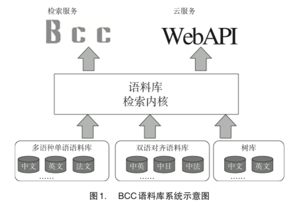
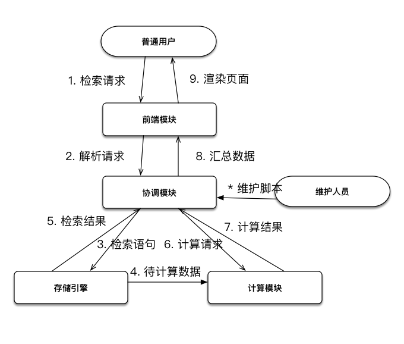
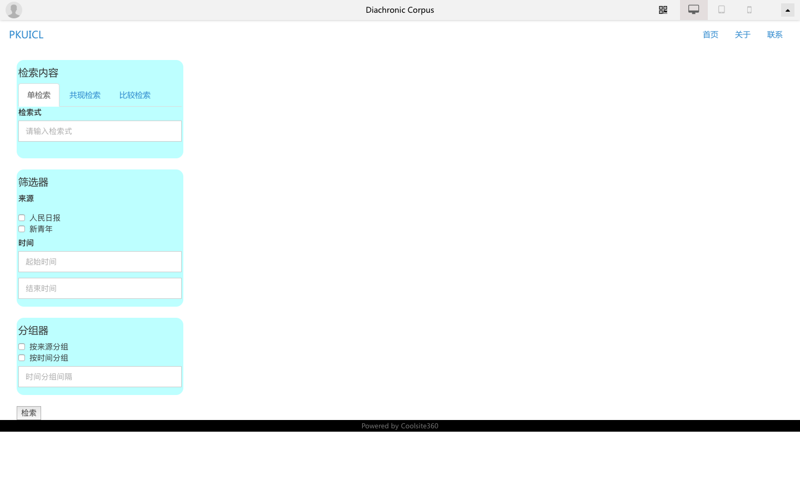
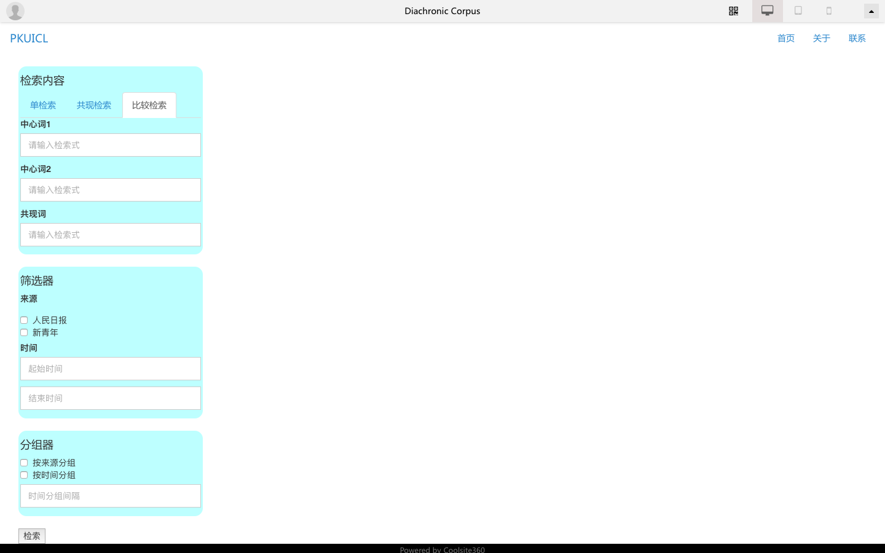
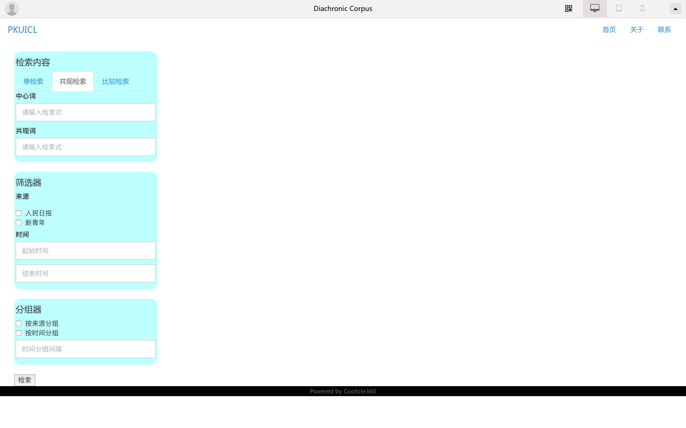
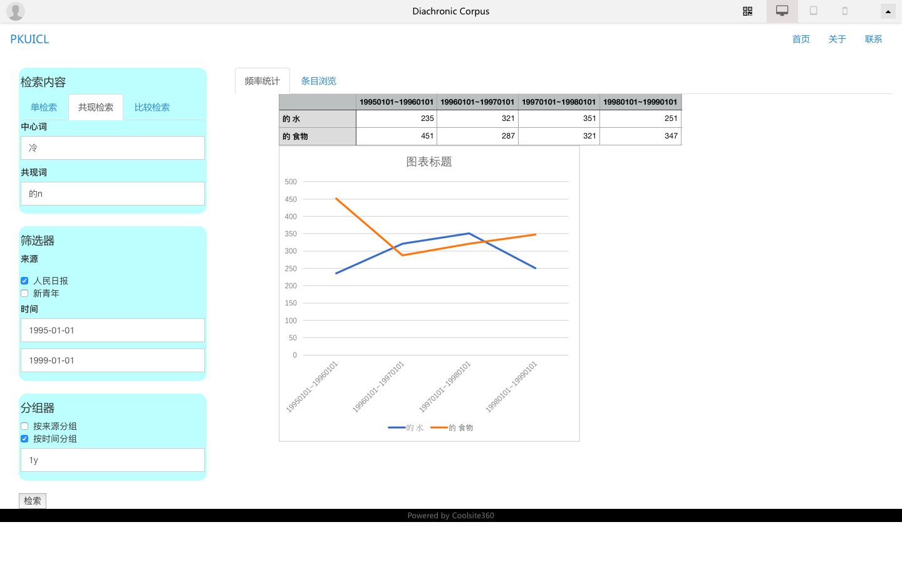
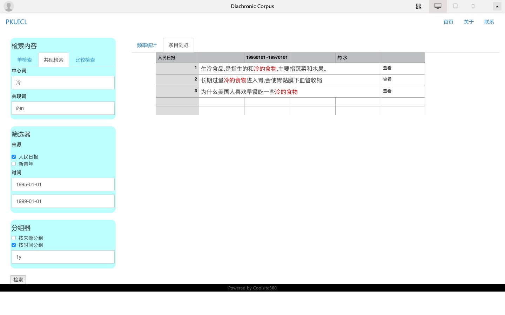

# 历时语料库设计方案

吴先

wuxian94@pku.edu.cn

## 目录

[TOC]

## 引言

本设计方案的主要内容分为三部分。第一部分对语料库进行介绍、对现有语料库功能的调研，以及我们的历时语料库的特色；第二部分介绍历时语料库软件的组成模块、各模块功能，约定历时语料库的操作方式，给出语料库的数据项定义和规范；第三部分为历时语料库的技术选型理由与方案。

第一部分的读者对象为对此项目感兴趣的广大人群，用以建立基本的概念，同时为后续设计做方向上的约束；第二部分的读者对象为历时语料库软件的使用者和需求方，通过对模块、功能和数据规范等抽象层面的约定，保证成品的功能与行为符合预期；第三部分的读者对象为本项目相关的技术人员，用以给出多种解决方案，讨论出最适合本项目的技术选型并加以实现。

读者对象的覆盖范围为后者包含前者的关系，即第三部分的读者对象也是第一、二部分的读者对象。

## 第一部分

### 1、语料库简介

语料库，一般经科学取样和加工的大规模电子文本库。借助计算机分析工具，研究者可开展相关的语言理论及应用研究。

语料库是语料库语言学研究的基础资源，也是经验主义语言研究方法的主要资源。利用大规模语料，对语言现象进行观察，可以为词典编纂、语言教学、传统语言研究、自然语言处理中基于统计或实例的研究方法提供帮助。同时，语料库也是模型训练的知识库，在自然语言处理中起到不可或缺的作用。

语料库可以根据语种、时间跨度、语料来源、存储粒度等特征进行分类。比如我们在下一节介绍的BNC语料库，就是单语言、共时、一般性的语篇语料库。

### 2、现有语料库调研

#### 2.1 北京语言大学语料库中心

北京语言大学语料库中心(BCC)是以汉语为主、兼有其他语种的语言大数据，目标是为语言本体研究提供一个使用简便的在线检索系统和构建大数据的语言应用基础平台。BCC 支持云服务，通过 API 调用方式为开展知识抽取、模型构建等研究和应用工作提供便利。

主要包括三方面工作:语料库资源建设、检索引擎开发和提供语料库检索服务。如图 1 所示，语料库的资源建设是构建语料库数据内容的基础。BCC 主要包括三种类型语料:多语种单语语料库、双语对齐语料库和深加工的树库。语料库检索内核是实现语料库系统的技术基础，采用基于后缀串的全文检索算法，并且支持通配符和离合模式匹配。检索服务是指使用语料库系统的方式和方法。

总字数约 150 亿字，包括：报刊（20 亿）、文学（30 亿）、微博（30 亿）、科技（30 亿）、综合（10 亿）和古汉语（20 亿）等多领域语料，是可以全面反映当今社会语言生活的大规模语料库。

* 语料库资源建设
  * 语料库涵盖多语种
  * 多层次语料加工
  * 现代古汉语语料和古代汉语语料兼具
  * 汉语多语体（小说、报纸，甚至微博）
  * 共时语料和历时语料兼具
* 语料库采集加工平台

  * 网上语料采集工具
  * 语料整理工具
  * 语言自动分析工具
  * 语料库标注平台
* 检索引擎
  * 支持语言大数据
  * 支持多语种检索
  * 支持多语料检索
  * 支持复杂检索

此外，还有关于词典的功能：

* 汉字字频、字释义
* 搭配扩展：左右邻词（按词性）
* 义项频率

#### 2.2 北京大学中国语言学研究中心

北京大学中国语言学研究中心CCL的语料规模相比BCC小了很多，大约是7亿字；但时间跨度非常大，从公元前11世纪一直到当代的语料都有涉及。而且具有双语对齐的语料，句对数23万，中文字数600万左右。

功能上也是以支持复杂的检索表达式为特色：

- 支持复杂检索表达式（比如不相邻关键字查询，指定距离 查询，等等）；
- 支持对标点符号的查询（比如查询“？”可以检索语料库 中所有疑问句）；
- 支持在“结果集”中继续检索；
- 用户可定制查询结果的显示方式（如左右长度，排序 等）；
- 用户可从网页上下载查询结果(text文件)；

其中的模式查询基本具备了BCC的的复杂检索的功能，而且支持更多检索模式。

遗憾的是虽然带有这么大的时间跨度，CCL只是将语料划分成了“现代汉语”和“古代汉语”两个大类，分别在各自的范围进行检索，没有在时间轴上的统计，并不能为我们提供历时语料库的功能范例。

另外双语语料库的部分，也是基于上述检索功能存在的。只是展示的时候分列了中文和英语的句对。

#### 2.3 英国国家语料库

英国国家语料库BNC收录了来自各种来源的书面和口头语言样本，旨在代表20世纪后期英国英语的广泛的横截面，包括口头和口头语言书面。最新版本是2007年发布的BNC XML版本。

BNC的书面部分占90%，包括地区和国家报纸，覆盖全年龄和兴趣的专业期刊和期刊，学术书籍和流行小说，已发表和未发表的信件和备忘录，学校和大学散文摘录等等。口语部分（10％）由非正式的非正式交谈（由不同年龄，地区和社会阶层的志愿者以人口均衡的方式记录）和不同背景下收集的口语进行转写，包括从正式的商业或政府会议到广播节目和电话通话。

它的主要特点是：

* 单语：它只涉及现代英式英语，不过也有一些别的语言在语料中。
* 共时：它涵盖二十世纪后期的英国英语，而不是产生它的历史发展。
* 一般性：它包括许多不同的风格和品种，并不限于任何特定的主题领域，流派或注册。特别是它还包含口头和书面语言。
* 采样：对于书面来源，从单作者的文本中采样了45,000字的样本。字数在45,000字以内的较短文本，或杂志和报纸等多作者文本，是完全包含的。抽样可以在1亿个单词的限制范围内扩大文本的覆盖范围，避免过度表现特殊的文本。

#### 2.4 基于英国国家语料库的检索引擎

英国国家语料库BNC本身并没有提供检索和查看功能，但是有大量基于此语料库的检索引擎，在此主要介绍BYU-BNC、BNCWeb和IntelliText。

简单检索语法

* 通配符、不完全的正则、加入词性限制、词语前缀
* 词序列、带通配符的词序列（通配符代表词而不是字母）、加入词性限制
* 词形检索（前缀+词性）、模糊检索（类似“在同一句中”这种关系）

数据库相关的检索语法

* 取决于数据库的具体实现，比如BNCWeb采用的CWB corpus数据模型采用的检索语言是CQP。

加入语料库信息的限制

* BNC的语料本身带有很多语料之外的信息，比如年份、领域、语料载体、作者国别/年龄/性别/类型（指多人还是单人）、目标人群年龄/性别等等。检索引擎也提供了对这些维度的限制。

展示方式

* 以句子的视角展示检索结果
* 以KWIC的视角展示检索结果
* 按照划定的上下文范围内的词排序，以检索词为中心词对齐后显示
* 比较两个检索结果（词频）

BNCWeb几乎把整个底层检索引擎的语法暴露了出来，所以网站上看起来功能没有BYU或者IntelliText丰富，但是已经包括了后两者大部分功能。比如BYU的collocates检索和IntelliText的Collocation检索，可以直接通过BNCWeb的带限制的词序列检索语法实现。

#### 2.5 各语料库比较与小结

基本的检索模式，各个语料库都大同小异。通配符、词性、slot区间检索，对于英文还有词前缀、词干检索等。

BNC历史悠久，语料的平衡性也非常好。其衍生的检索引擎功能也很丰富。只是也是因为开发的年代比较早，易用性和用户体验也相对差一些。但是它的检索模式值得我们借鉴，比如对collocates/collocation的支持（即给定中心词模式，再给出搭配模式），和多样的展示方式（KWIC、LIST、CHART等）。

BCC的界面更为易用，对基本检索式的支持也达到了日常使用需求（其实它也定义了一套自己的检索式，只是核心功能也没有超出上面提到的）。语料库的覆盖面，或者说语料来源和语种也更为丰富，也提供了基础的历时检索查询。

CCL的语料数量相对来说较小，但是具有两个巨大的优势：非常大的时间跨度，以及双语对齐语料。同时CCL还提供了一个语义词典，丰富了词、字的特征。

我们的语料库希望在易用性、功能全面的角度，借鉴上述语料库，并且体现出自己的特色。

### 3、历时语料库特色

历时语料库是在普通的语料库的基础上，加入时间轴，在时间维度上对语料进行划分并分析的语料库。一方面要面向数据库维护人员，方便进行数据的导入、预处理和管理工作；另一方面要面向研究者，提供基本的数据统计和分析，以及下载功能。

在历时的基础上，希望能够将关于本体挖掘、语义建模和句子模式相关的成果，在语料库上也有所体现，以提供更多功能。比如句子级别的同义句、同模式句；词语/本体的语义、用法、词语搭配随时间的变化等等。因此在基本的历时语料库功能和设计基础上，还要保留足够灵活的接口，使后续的研究成果能够转化上去。

## 第二部分

### 4、项目概述

#### 4.1 目标

总体目标为实现具有上述历时语料库特色的语料库软件，下面分模块描述目标。

* 协调模块，用于协调各模块的运作。同时也提供预处理功能，支持通过脚本，从本地导入满足数据规范的数据，在存储引擎中建立持久存储与索引，完成其他计算模块所要求的预处理（比如句子向量），输出数据的存储位置和操作日志。
* 前端交互模块，通过web服务，为普通用户提供数据库的全功能、友好的检索接口/页面。输入为检索要求，输出为检索的结果、数据统计及相关图表和下载链接。
* 存储和检索模块，为预处理和前端提供存储和检索支持，并加入基本的数据统计功能。输入为前端定义的检索要求，输出为具体存储引擎支持的指令和对响应结果的后处理。
* 计算模块，用于进行计算密集型任务的处理，比如同义句检索。输入和输出与各模块具体功能相关。

#### 4.2 运行环境

单机部署，运行环境为基于Linux的server级主机。

硬盘可用空间1TB以上，能够随语料库规模的扩大，扩展存储空间。

内存16GB以上，以实现检索的快速响应。

带有安全防护的可用的网络连接。

#### 4.3 需求概述

* 数据库操作人员
   	1. 功能需求：非结构化数据预处理
       性能需求：保证健壮性和吞吐量
   	2. 功能需求：海量数据存储与索引
       性能需求：总量在TB级，峰值速率的压力可能不会很大
* 科研用户
  1. 功能需求：数据库的实时查询和结果统计分析
     性能需求：对简单的查询需求，响应速度达到秒级；大规模数据的导出和组合查询，响应速度达到分钟级
  2. 功能需求：查询结果的图形化展示、管理与下载
  3. 功能需求：方便的成果转化接口

### 5、总体设计

#### 5.1 体系结构

扁圆代表操作人群，圆角矩形代表软件模块，箭头代表请求或数据流向，数字代表一次完整请求的请求/数据流。

#### 5.2 软件构成

从需求出发，历时语料库管理分析平台是包含从数据预处理、存储、统计分析，直到检索和对结果的分析的完整平台。

平台共分为4个模块，分别是前端模块、协调模块、存储引擎和计算模块。管理员负责整个架构的开发和维护，科研用户利用检索与统计分析结果进行研究，而实验室的同学们可以利用研究成果，将算法加入计算模块，甚至固化到存储引擎模块，提供更丰富的检索方式。

平台旨在提供大规模语料与多维检索的解决方案，并尽可能丰富实验室成果对外的展示能力。通过加入对第三方开放的自定义算法模块，集合更多科研用户的智慧。

#### 5.3 操作约定与跳转逻辑

这里重点描述用户的检索操作和相关的跳转逻辑。

##### 检索与统计分析操作

可能的检索方式：

1. 单词，比如“冷”
2. 词性，比如“形容词”
3. 词组、词性组、单词词性组，比如“冷[名词]”
4. 近义词、反义词

可能的展示与统计方式：

1. 检索与检索到的结果显示，按年份统计频率。点击某年份，给出所有片段。
2. Collocates，即比较给出的两个词的一定范围内的，满足上述检索方式的结果数量的比例。比如，给定的词是“冷”和“热”，范围是“右二”，检索规则是“名词”，那么给出这两个词在右边两个字以内的名词的出现频率的差异。
3. 上下文，跟collocates的展示类似，只不过是对一个词的搭配的出现频率进行展示。

##### 具体功能与页面逻辑

首先对检索请求进行定义

1. 填写检索内容

   * 可以是单检索式、共现检索、比较检索。
   * 单检索式就是输入一个模式，在语料库中匹配。
   * 共现检索是输入两个模式，前者是中心词，后者是共现模式，然后根据共现模式进行分组再统计。比如中心词是“冷”，共现模式是“DET N”，就会按照“的 水”，“的 食物”这样的条目进行分组、统计、展示。
   * 比较检索跟共现检索类似，填写两个中心词和一个共现模式。同样根据共现模式分组，显示两个中心词的统计结果。

2. 设置过滤器

   * 比如按照来源、时间段等元信息对结果进行过滤。

3. 设置分组器

   * 按照过滤器的条目，对结果进行分组。
   * 比如来源就是直接按照语料来源进行分组统计，时间则是按照给定的时段作为桶进行分组。
     这样才能直观地看到随着时间、随着语料的不同，统计结果的变化。
     也是能够展示出历时语料库的特点的功能。

然后开始检索和展示

开始检索后，按照分组、按照检索模式，对统计结果做展示。

4. 首先显示词频等统计结果。
   每一行是一个检索结果。

   * 单检索式，比如“冷的n”，那么每一行的结果就是“冷的水”“冷的食物”等等。
   * 共现检索，比如中心词是“冷”，检索模式是“det n”，那么每一行的结果就是“的水”，“的食物”。共现检索与单检索的差别在于，共现检索可以设置更大的共现范围，比如前后5个词以内。
   * 比较检索，跟共现检索类似。取两个中心词的检索结果的并集。

   每一列是分组器分出的组。

   * 如果设置了多个分组器，可以设置分组的组合模式。比如设置成['人民日报','新青年']与['19950101~19960101', '19960101~19970101']的笛卡尔积。那么就会存在四列。
   * 在绘制图表时，以时间作为横坐标，以其他的分组依据作为一个绘图组。比如柱状图，横坐标是'19950101~19960101'与'19960101~19970101'，在每一个横坐标的取值上，有两个柱子，分别是在人民日报和新青年中的统计结果。

5. 通过点击柱子，进入对应筛选结果的具体展示环节。
   当然柱状图也可以切换成折线图。

具体展示环节

6. 以检索结果做中心对齐，展示所有检索结果。
   对检索到的句子，展示其更多特征。比如近义句、类似模式句等。初步设计为采用RNN encoding的结果，对近义句进行检索。

#### 5.4 数据规范

存储的数据以句子为单位存储。

数据应该具有以文章为单位的标记，并且包含类似于句子序号的顺序信息。

数据最好带有准确的分词和词性标记，以保证语料库质量。

### 6、原型设计

原型设计为页面交互逻辑和展示内容的约定，不代表最终视觉效果。

#### 6.1 首页原型
首页的主要差别是三种检索方式，分别用三张图展示了要如何输入检索内容。共现检索忘记画窗口范围了，应该是一个1～k的滑块。

##### 首页-单检索

##### 首页-比较检索

##### 首页-共现检索

#### 6.2 结果展示页面原型
点击检索后，进入具体的频率统计和条目查看的阶段。
这里频率统计和条目查看以共现检索为例。当检索中心词为“冷”，共现模式为“的n”，会匹配出图中的结果（数据和词组都只是事例）。每行词条都有复选框，下面的折线图会根据选择的词组更新。
点击具体的一个时段、来源和词组后（也就是固定了过滤器的组别和一个词组），会进入条目查看页面，显示所有匹配到的句子。点击句子进入查看句子特征的环节。

##### 共现检索-频率统计

##### 共现检索-条目浏览

## 第三部分

### 7、技术选型

这一章节给出了针对各模块的技术选型方案。学识所限，很多方案可能并不是最适合的方案，所以只是把我了解到的内容列在这里。

#### 7.1 前端框架

目前考虑过的前端框架有ElementUI+Vue.js和bootstrap+jquery。

前者是完全的前后端分离的思路，用vue单独写前端的页面和逻辑，与后端模块通过http+json进行交互。

后者其实也可以分离，只是顺着flask的Jinja2渲染引擎写下来，跟后端就融合在一起了。

从熟悉的程度上，后者是当初写ACL Anthology时使用的技术，所以更熟悉些。

#### 7.2 语料存储、检索引擎

这一部分绕的弯有些大。我一开始确实陷入了过于重视“全文检索”的误区，而且也没查到没想到如何使用关系型数据库做上面提到的检索。因为我可能更喜欢用现成的框架和轮子来完成检索任务，从而避免手写检索逻辑，防止为了调试或者调性能而越走越远。所以这里的选型会沿着全文检索的方向做调研。

##### 面向对象数据库

面向对象数据库主要是区别于关系型数据库的概念。

以前用的关系型数据库把所有数据用二维表的方式管理，要预先定义好列、关系，用主键来标识所有数据。用SQL语言来对数据库进行建立、查询、插入等等操作。但是SQL是解释实现的，效率不尽人意。而且使用的绝大多数应用都是由高级程序设计语言实现，面向单个数据进行操作，因此与SQL之间存在不匹配的现象（被称为阻抗失配）。

不过上述问题其实现在也有比较简单的解决方案。没理解错的话，现在的很多数据库引擎是用于在一定程度上解决这个失配现象的。ORM（对象关系映射）的概念，以及建立于其上的DAO（数据访问对象），都是在高级语言中通过预先与数据库进行连接以及模型的定义，来使编程的过程更加简单，不必去关注数据库层面的操作和定义，而是以对象的方式操作数据体。

面向对象数据库（或者说对象数据库）直接以对象的方式存储和管理数据。它鼓励人们以对象的方式思考数据，包括在对象上定义的方法。这与关系型数据库是不同的，关系型数据库主张程序与数据分离的思路。（不过至少就这一点上，难说谁更优越）

面向对象数据库的技术基础是XML语法的建立。有了XML，程序可以把定义附加在数据上，便于数据和数据定义的交流。在这里或许解决了我一开始看面向对象数据库时的疑问，就是它与NoSQL数据库是怎样的关系。NoSQL数据库打破了SQL数据库对于主键、列这些概念的约束（大体上就是关系型数据库的约束）。然后NoSQL数据库的一个类别就是文档型数据库，无论是以BSON格式存储文档的mongoDB，还是早期以XML格式存储数据的对象数据库，都是希望解决关系数据库过于严格的约束。当然面向对象数据库也不仅仅就是文档型数据库，这里只是说它们存储方式的相似性。另外后面会提到的CWB也是以XML方式存储数据的。

最后，面向对象数据库还吸收了面向对象程序设计语言的思想，如支持类、方法、继承等概念。

不过面向对象数据库也不是没有缺点，比如它相比于关系型数据库的优点：它适用于操作单个数据，那么它在进行大规模数据处理的时候就要比关系型数据库的效率差很多。而且由于对象数据库往往比较复杂，它的权限管理也不如关系数据库全面。

##### 数据立方体

数据立方体是利用元数据进行关键字的实时索引的模型，建立在数据存储层和数据库系统之上。总的来说，Text Cube就是将OLAP（在线实时分析）和IR技术结合的，对文本数据建立的数据立方体模型。它提供了将具有多维特征的文本数据存储、索引和在其上进行快速的分析的功能（文中是以词频统计和倒排索引为例的）。其内部包含两种层次结构，维度层次结构和术语层次结构。

文档被存储在n维数据库中，每篇文档的形式是(a1,a2, …, an, d)，其中d是文档内容本身，a1~an分别是n个特征维度。

关于cell、cuboid、subcube的定义。cell的形式是(a1, a2, …,an: F(D))，其中ai可以是一个取值，也可以是*表示所有值。F(D)表示的是满足上述a1~an的文档集的一个IR统计量，当然也可以就是文档集本身。cuboid是cell构成的集合，可以看做是原本的text cube降维之后的形态，把某些维度删去（拍扁）。subcube是构成cuboid的cell的子集。

在两种层级结构上的操作

* 维度层次结构

维度是普通的数据立方体就具有的结构。比如时间、地点之类的属性。这些属性也可以组织成树或者DAG的结构，就变成了维度层次。涉及到的操作有Roll-up、Drill-down（互为逆操作，比如把时间维度上的1949年drill-down成1949年1月、2月…12月；或者反过来）和Slice与Dice（这两个是维度上的操作，在某一维上选取一个或者一些值）。

* 术语层次结构

这是建立在文本立方的词典上的，用于表示词语的语义级别或者关系。其中叶子节点是术语，非叶子节点被称为广义术语（表达方式就是它的所有子孙叶子节点的集合）。在术语层次上定义了两个操作，pull-up和push-down，其操作对象是一个术语层次，将一个层次上的某一个词向上（或向下）走一级，并且删除新词的子孙（或者父亲）。比如我们原本处在层次(猫，狗，可爱，喂食）上，对“猫”做pull-up后，处在层次（宠物，可爱，喂食）上。

同时文章介绍了在这样的文本立方上，如何做检索和在检索结构上的IR统计。对于各种检索请求，其IR统计发生的基本单位是cell。在cell上进行统计后，针对检索请求（可能是一个点检索，也可能是一个subcube检索，因为前者是后者的子过程所以只讨论前者），这个请求结果很大可能是需要由cell聚合而成的。如果数据库时n维，而点检索只定义了r维，那就有n-r个维度需要聚合。聚合的时候针对哪一个维度做聚合。比如具有（时间，地点，文本来源）三个特征的数据库，当检索只限定了文本来源，那么是根据时间聚合，还是根据地点聚合，就是两个decision。（这里的前提是一部分cell是做了预计算的，否则不管根据谁做聚合都一样）。文章是通过动态规划的方式计算计算复杂度和记录路径的。

在text cube上已经进行了一系列NLP任务，比如不同背景（就是不同cell和subcube）下的短语提取，基于短语的多维摘要、实体关系挖掘等等。

 如前所述，我很喜欢他们这种构建多维语料库的思路，将外部的信息与语料本身的信息很好地结合起来，在同一个视角和空间里对数据进行索引和分析。我们的手上恰好就拥有这样层次化的语义知识先验，在语义变迁的申请书中也看到了关于语义层次、历时语义变迁的相关需求和研究成果，可以良好融入这样的数据模型中。

##### CWB与CQP

这个是IntelliText采用的语料库检索引擎和相应的检索语言。

CWB（IMS Open Corpus Workbench）是利用XML保存语料数据的系统。支持保存格式化文本（粗体斜体之类的标记）、tokenized文本、带语言学标记的文本（比如An/DET/a作为每一个token）和利用CWB工具编码过的文本。他的存储方案大致是以词位为基本的存储单位，就像上面的例子，An、DET和a位于同一词位的不同列。整个句子存储下来就像一个二维表（词位*列）。在建立索引时，会对所有列建立混合的索引，支持我们在BNC、BCC等语料库中看到的那种索引方式（比如“可爱的n”）。

CQP是应用于CWB的检索语言，本身也是一个软件。虽然软件起源于2005年，但是幸运的是这个软件和文档直到2016年5月还有过更新，不至于太过过时。它提供的检索语法可以在不同列上进行混合索引，也可以对检索结果进行进一步处理，比如进一步检索、做结果集合的并集等等。

##### ElasticSearch

我看中的其实是他使用analyzer机制提供的自定义用于索引的token图的能力。在一个数据被存储的时候，会经过自定义的analyzer。analyzer是由filter、tokenizer和token filter组成的包。

filter用于对原字符串进行字符级的过滤，比如过滤掉html标记。

tokenizer将原始的字符串分解成token流，比如以空格为分隔标记的"whitespace" tokenizer。

token filter用于对token流中的token进行过滤、修改和转换。token是由token、start_offset、end_offset、type和position五个字段组成的元素。利用相同的start_offset和end_offset，“同义词”类型的type，可以实现自动的平行索引。

